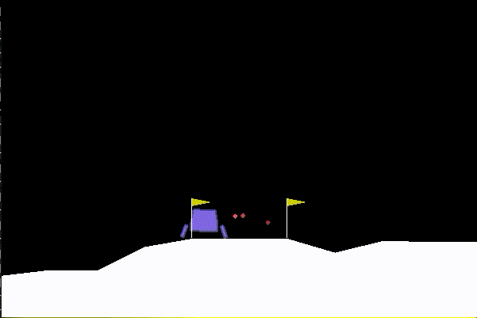
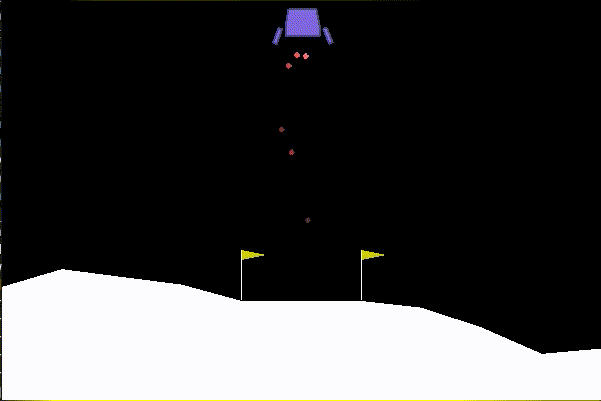

# ESA_OpenAiGym
ESA is a proposal for automatic problem solving when involving kinects
or logic. The proposal is to add to the top layer of the subsumption
architecture proposed by R. Brooks a layer that is capable of simple
reasoning to select the appropriate strategy. The interaction among
layers defines a plan or subplan for solving a problem.
The proof of concept uses OpenAI Gym Lunar Lander challenge for
demonstration and test of concept.
In this code, the abstraction of the physics is captured by a multi
layer perceptron, but could use more sophisticated ways of deducting the
results of the interactions although for this simulation it can achieve
scores as high as 0.92 according to the tests realized.
Another MLP is used to predict the score of the next action, but it
achieves pretty lower results because this simple MLP could
not abstract the penalties by the OpenAI challenge. The score for this
MLP achieved 0.53. This is not a problem for the proposal of ESA since
it does not expect for all the subsystems to be fully realiable.
The result of the interaction of lower subsumption layers and the
heuristic-reasoning in the top layer could develop plans for landing the
lander, but it struggles when facing the dimensionality problem. For
example, a good heuristic for landing is to achieve the target point
with very low speed, but it demands several adjustments to the rotation
of the vector. The ship may decide that the best strategy for not
landing too fast is achieved by not landing at all or using very long
horizontal lines to safely reach the ground. The latter is observed in
the results of the paper accompaning this work. When using the Lunar
Lander challenge as is, the ESA-Auto tries with higher frequency the
horizontal approach.
Yet, this work presents a interesting way of defining targets and
priorities and strategies for a machine to create a plan. It poses the
challenge of balancing the weights for each element. This could be
explored by the usage of another machine learning system, such as
another neural network, to define the weights. The article also proposes
other ways of exploring the ideas by extending the concepts of the ESA.
Comparing to other available concepts the ESA is a cheap
since it uses simple predictions for the next steps and apply a
competition of heuristics to select create a plan.

